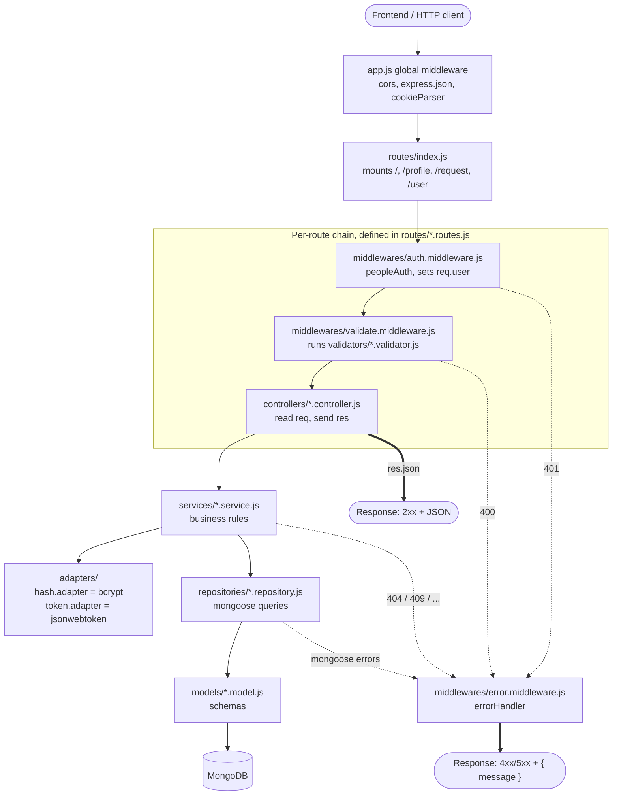
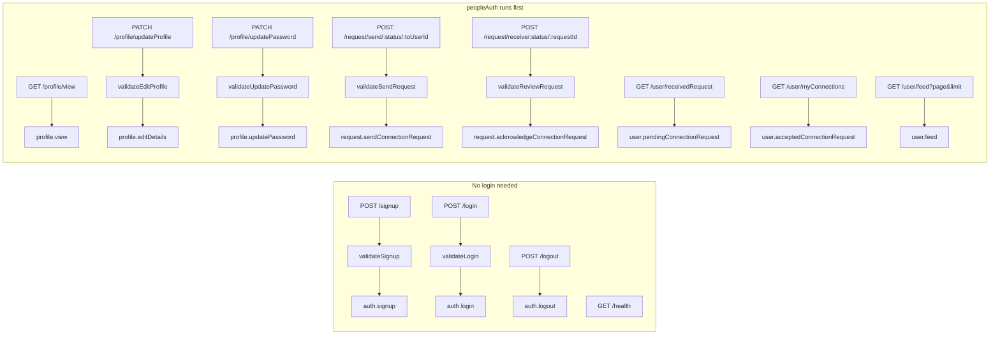
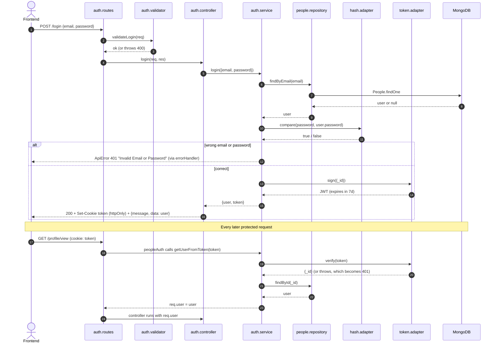
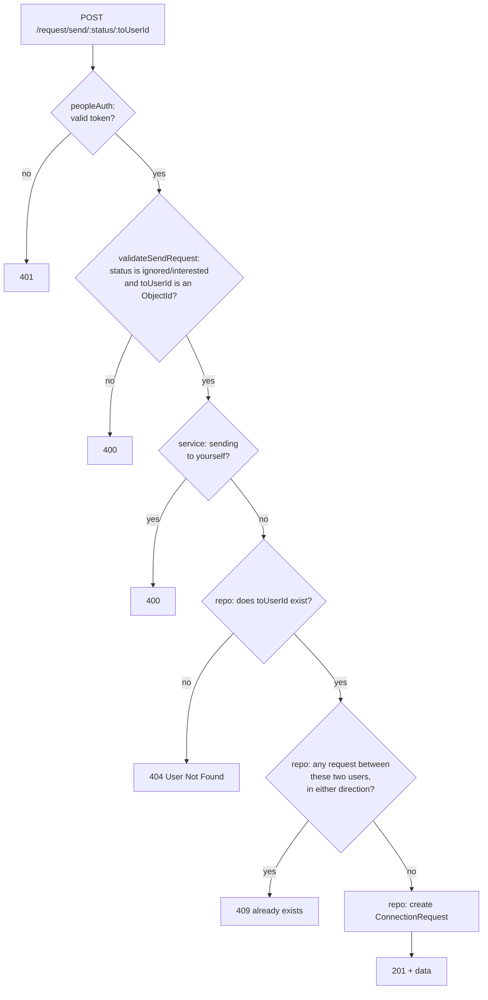
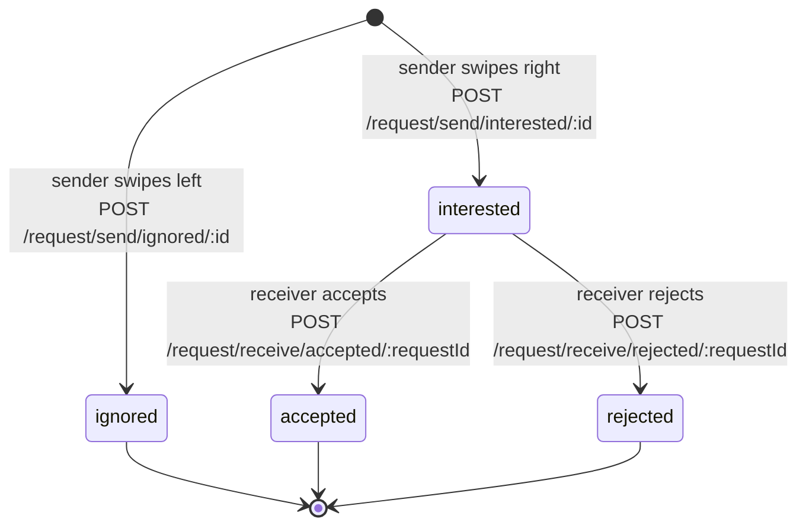
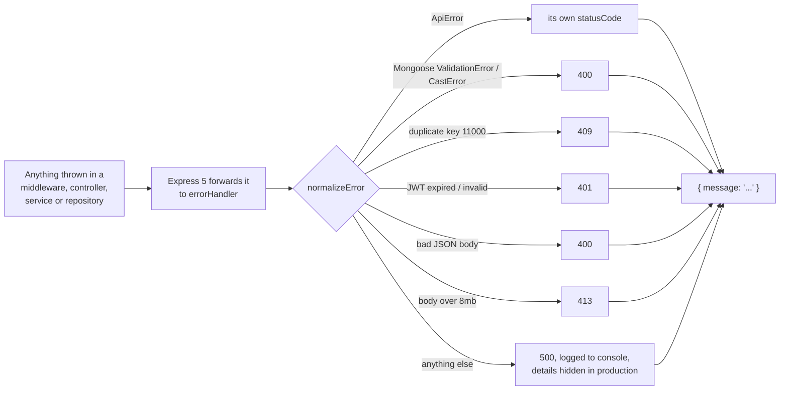

# devTinder Backend

Express 5 + MongoDB (Mongoose) API for devTinder.

## Running

```bash
cp .env.example .env   # then fill in the values
npm install
npm run dev            # nodemon, for development
npm start              # plain node, for production
```

## Project structure

A request flows **route → middleware/validator → controller → service → repository → model**.
Each layer only talks to the one below it.

```
src/
├── server.js         # entry point: connects to DB, starts listening, graceful shutdown
├── app.js            # builds the express app (middleware + routes + error handler)
├── config/           # env loading/validation, DB connection, cookie options
├── constants/        # statuses, allowed fields, limits - no magic strings elsewhere
├── routes/           # URL → middleware chain → controller. No logic.
├── middlewares/      # auth (peopleAuth), validate, 404 + central error handler
├── validators/       # request-shape checks (body/params); throw ApiError(400)
├── controllers/      # read req, call a service, shape the HTTP response
├── services/         # business rules (e.g. "can't send a request twice")
├── repositories/     # all mongoose queries live here
├── models/           # mongoose schemas
├── adapters/         # wrappers around third-party libs (bcrypt, jsonwebtoken)
└── utils/            # ApiError, pagination helper
```

### Where does new code go?

| You want to…                              | Put it in        |
| ----------------------------------------- | ---------------- |
| Add an endpoint                           | `routes/` + `controllers/` |
| Reject a bad request body / param         | `validators/`    |
| Add a business rule                       | `services/`      |
| Write a new DB query                      | `repositories/`  |
| Use a new external library / API (email, S3, …) | `adapters/` |

### Errors

Throw `ApiError` (`ApiError.notFound("...")`, `ApiError.conflict("...")`, …) from anywhere.
Express 5 forwards thrown/rejected errors to `middlewares/error.middleware.js`, which also
maps Mongoose/JWT errors to the right status. Every error response is `{ "message": "..." }`.

## How the code flows

### 1. Layers at a glance

Every request passes through the same stack. Arrows show who calls whom. A layer never
skips downwards (a controller never runs a query) and never calls upwards.



`config/`, `constants/` and `utils/` are shared helpers that any layer may import, so they
are left out of the diagram.

### 2. Which route goes where



### 3. Example: login, then an authenticated request



### 4. Example: sending a connection request

This is the flow with the most business rules, and all of them live in `request.service.js`.



### 5. Life of a connection request



- Only `interested` requests appear in the receiver's `GET /user/receivedRequest`.
- Only `accepted` requests appear in `GET /user/myConnections`.
- Anyone the user has a request with, in **any** state and either direction, is left out of `GET /user/feed`.

### 6. How errors become responses



## Environment variables

See [.env.example](.env.example). `PORT`, `DB_CONNECTION_STRING` and `JWT_SECRET` are
required - the server refuses to start without them.
