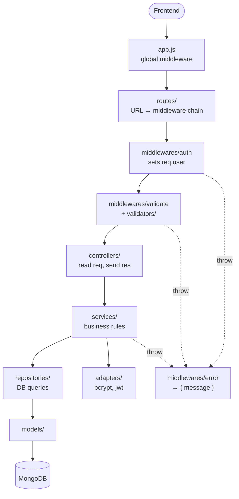

# Backend Refactor Checklist

This is a step-by-step guide for turning this codebase into a layered,
production-style backend **yourself**. It tells you *what* to build and *how to check
it*. It does not give you the code.

How to use it:
- Work **top to bottom**. Each phase builds on the one before it.
- After every phase the app must still work. Run the **regression list** at the
  bottom in Postman, then commit.
- Do one phase per branch or commit, so a mistake is easy to undo.
- Tick `[ ]` → `[x]` as you go.

---

## The target, in one picture



## The rules, to keep next to you

| Layer | Allowed to | NOT allowed to |
|---|---|---|
| **routes** | wire a URL to its middlewares and controller | contain any logic |
| **validators** | look at `req.body` / `req.params` and throw a 400 | touch the database |
| **controllers** | read `req`, call **one** service, send `res` | run queries, hash passwords, contain `if` business rules |
| **services** | business rules, call repositories and adapters, throw `ApiError` | see `req` or `res`, import mongoose models |
| **repositories** | run mongoose queries, return results | decide anything (no business `if`s, no HTTP status codes) |
| **adapters** | wrap one outside library (bcrypt, jsonwebtoken, later email or S3) | know about your business |
| **models** | schema shape, low-level field validation | sign tokens or hash passwords |

**Where does this line of code go?**
- Is the request *well-formed*? → validator
- Is it *allowed by the app's rules*? → service
- Does it *talk to MongoDB*? → repository
- Does it *call a library*? → adapter
- Does it *touch `req`/`res`*? → controller

**Naming:** use one style throughout, e.g. `auth.controller.js`, `auth.service.js`,
`people.repository.js`, `hash.adapter.js`. Plural folders: `controllers/`, `middlewares/`.

---

## Phase 0: Before you start
- [ ] Create a branch: `git checkout -b refactor/layers`
- [ ] In Postman, save one request for **every endpoint** (see the regression list at
      the bottom) and run them all once against the current code. This is your
      baseline. Note what each one returns.
- [ ] Read about how **Express 5 handles errors in async functions**. In Express 5,
      if an `async` handler throws or a promise rejects, Express passes the error to
      your error middleware **automatically**. Much of the cleanup below depends on
      this.

---

## Phase 1: Config (one place for env variables)

**Problem today:** env values are read all over the place. The JWT secret is
hardcoded in one file and read from `.env` in another.

- [ ] Create `src/config/env.js`
  - [ ] Call `require("dotenv").config()` at the very top of this file
  - [ ] Make a list of required variables: `PORT`, `DB_CONNECTION_STRING`, `JWT_SECRET`
  - [ ] If any are missing, **throw at startup** with a message naming them
  - [ ] Export one frozen `config` object (`port`, `dbConnectionString`, `jwt.secret`,
        `jwt.expiresIn`, `corsOrigins`, `isProduction`)
- [ ] Update `config/database.js` to read the connection string from `config`, not `process.env`
- [ ] Fix the bug in `middleware/authMiddleware.js:18`: `jwt.verify` uses the hardcoded
      `"DEV@devTinder123"`. Use the secret from config instead.
- [ ] Delete the `console.log("Decoded message: ...")` at `authMiddleware.js:19`. Tokens
      don't belong in logs.
- [ ] Move the CORS origin (`app.js:14`) into config, e.g. a `CORS_ORIGINS` env var
- [ ] Create `.env.example` listing every variable with fake values. Commit it, but
      never commit `.env`.

**Done when:**
- Removing `JWT_SECRET` from `.env` makes the server refuse to start with a clear message.
- `grep -rn "process.env" src` only finds `config/env.js`.

---

## Phase 2: Split `app.js` into `app.js` + `server.js`

**Problem today:** one file both *builds* the app and *runs* it, so you can't load
the app in a test without connecting to the real DB.

- [ ] Move `app.js` into `src/app.js`. It should only:
  - create the express app
  - add global middleware (cors, json, cookieParser)
  - mount routes
  - add the 404 and error handlers (Phase 3)
  - `module.exports = app`
  - It must **not** call `connectDB()` or `listen()`.
- [ ] Create `src/server.js`. It should:
  - [ ] `require` config first, then the app
  - [ ] `await connectDB()`, then `app.listen(config.port)`
  - [ ] log the **real** port (today's `app.js:28` always prints 2003)
  - [ ] on startup failure: log the error and `process.exit(1)`. Today the process
        stays alive doing nothing.
  - [ ] on `SIGINT`/`SIGTERM`: `server.close()`, then close the mongoose connection,
        then exit (look up "graceful shutdown")
- [ ] In `package.json`: set `"main"` to `src/server.js`,
      `"dev": "nodemon src/server.js"`, and add `"start": "node src/server.js"`

**Done when:**
- `npm run dev` works.
- Ctrl+C prints your shutdown message.
- You can `require("./src/app")` in a node shell without anything connecting.

---

## Phase 3: One way to handle errors

**Problem today:**
- Every controller has its own `try/catch → res.status(400)`.
- So every error is a 400, even a server bug.
- Raw Mongo messages (`E11000 duplicate key ...`) reach the user.
- Unknown URLs return Express's HTML page instead of JSON.

- [ ] Create `src/utils/ApiError.js`
  - [ ] A class that extends `Error` with a `statusCode` property
  - [ ] Static helpers: `badRequest` (400), `unauthorized` (401), `forbidden` (403),
        `notFound` (404), `conflict` (409)
- [ ] Create `src/middlewares/error.middleware.js` with two functions:
  - [ ] `notFound(req, res, next)`, which passes a 404 `ApiError` to `next(...)`
  - [ ] `errorHandler(err, req, res, next)`. It **must take 4 arguments**, or Express
        won't treat it as an error handler.
    - [ ] `ApiError` → use its `statusCode`
    - [ ] mongoose `ValidationError` → 400 (join the `err.errors[*].message`)
    - [ ] mongoose `CastError` → 400 (e.g. a bad ObjectId)
    - [ ] `err.code === 11000` → 409 (duplicate key)
    - [ ] `TokenExpiredError` / `JsonWebTokenError` → 401
    - [ ] `err.type === "entity.parse.failed"` → 400 (bad JSON body)
    - [ ] `err.type === "entity.too.large"` → 413
    - [ ] anything else → 500. Log it with `console.error`, and **don't** send the
          internal message in production.
    - [ ] always respond with the same shape: `{ message }`
- [ ] Register both in `app.js` **after** the routes: `app.use(notFound)`, then `app.use(errorHandler)`
- [ ] Convert **one** controller first (e.g. `profileController.view`): remove its
      `try/catch` and let errors throw. Test it, then do the rest.

**Done when:**
- `GET /nonsense` returns JSON with status 404.
- Sending `{bad json` returns a 400.
- No controller contains a `try/catch` anymore (logout is the one exception, see Phase 9).

---

## Phase 4: Constants (no magic strings)

**Problem today:** values like `["ignored","interested"]`, `"firstName lastName"`, the
allowed update fields, and the page limits are copied into several places.

- [ ] Create `src/constants/index.js` and move these into it:
  - [ ] `CONNECTION_STATUS` (`IGNORED`, `INTERESTED`, `ACCEPTED`, `REJECTED`)
  - [ ] `SEND_REQUEST_STATUSES` and `REVIEW_REQUEST_STATUSES`
  - [ ] `GENDERS`
  - [ ] `USER_PUBLIC_FIELDS`: the fields safe to show about *other* users
  - [ ] `EDITABLE_PROFILE_FIELDS` (now in `utils/validation.js`)
  - [ ] Profile limits: name length, bio length, age range, max skills, skill length
  - [ ] Pagination: default page, default limit, max limit
- [ ] Use the constants in the models too, e.g. `enum: Object.values(CONNECTION_STATUS)`

**Done when:** searching for `"interested"` in quotes only finds `constants/`.

---

## Phase 5: Adapters (wrap outside libraries)

**Problem today:** `bcrypt` and `jsonwebtoken` are imported in models, controllers and
middleware. The model has `validatePassword` and `getJWT` methods, so the model knows
about security libraries.

- [ ] Create `src/adapters/hash.adapter.js` exporting `hash(plain)` and `compare(plain, hashed)`
      - salt rounds come from config
- [ ] Create `src/adapters/token.adapter.js` exporting `sign(payload)` and `verify(token)`
      - both use `config.jwt.secret`, so they can never disagree again
      - `sign` sets `expiresIn` (e.g. `"7d"`). Today tokens **never expire**
        (`models/people.js:77`).
- [ ] Remove `validatePassword` and `getJWT` from `models/people.js` (you'll call the
      adapters from services in Phase 7)

**Done when:** searching for `require("bcrypt")` and `require("jsonwebtoken")` only
finds the two adapter files.

---

## Phase 6: Repositories (all DB queries)

**Problem today:** `People.find`, `ConnectionRequest.findOne`, `.populate(...)` and so
on are written directly in the controllers.

- [ ] Create `src/repositories/people.repository.js`, with one function for each query
      you need, such as:
  - `create(data)`, `findById(id)`, `findByEmail(email)`, `existsById(id)`
  - `updateById(id, update)`: use `findByIdAndUpdate` with `runValidators: true` and
    `returnDocument: 'after'`
  - `updatePassword(id, hash)`
  - `findExcluding({ excludedIds, fields, skip, limit })` for the feed. Add a
    `.sort({ _id: 1 })` so pages don't shift between requests.
- [ ] Create `src/repositories/connectionRequest.repository.js`:
  - `create(data)`
  - `findBetweenUsers(a, b)`: the `$or` query, in either direction
  - `findPendingByIdForReceiver(requestId, receiverId)`
  - `updateStatus(request, status)`
  - `findPendingForReceiver(userId, fields)`: with `populate`
  - `findAcceptedForUser(userId, fields)`: with `populate`
  - `findAllInvolvingUser(userId)`: only `fromUserId toUserId`, using `.lean()`
- [ ] Repositories **return data or `null`**. They never throw `ApiError` or decide what
      "not found" means; that's the service's job.

**Done when:** no file outside `repositories/` imports anything from `models/`.

---

## Phase 7: Services (business rules)

**Problem today:** the rules ("can't send twice", "only the receiver can accept") are
mixed in with HTTP code.

Rule for every service function:
- It takes plain values (`userId`, `{ email, password }`), **never `req` or `res`**.
- It returns plain data.
- It throws `ApiError` when a rule fails.

- [ ] `services/auth.service.js`
  - [ ] `signup(data)`: if the email already exists → `conflict`. Hash with
        `hashAdapter`, then `peopleRepository.create`.
  - [ ] `login({ email, password })`: return `{ user, token }`. **Use the same
        message** for a wrong email and a wrong password ("Invalid Email or Password").
        Today `authController.js:57` says "Invalid User", which tells an attacker
        which emails are registered.
  - [ ] `getUserFromToken(token)`: no token → `unauthorized`; `tokenAdapter.verify`;
        `findById`; no user → `unauthorized`
- [ ] `services/profile.service.js`
  - [ ] `updateProfile(userId, updates)`: an empty string for `gender` or
        `profilePicUrl` should **remove** the value (`$unset`), not fail validation
  - [ ] `updatePassword(user, { oldPassword, newPassword })`
- [ ] `services/request.service.js`
  - [ ] `sendRequest({ fromUserId, toUserId, status })`, with these checks in order:
        sending to yourself → 400, receiver doesn't exist → 404, request already
        exists → 409, then create
  - [ ] `reviewRequest({ receiverId, requestId, status })`: not found → 404
- [ ] `services/user.service.js`
  - [ ] `getReceivedRequests(userId)`
  - [ ] `getConnections(userId)`: return only the *other* person in each connection,
        and **skip `null`** (the other user may have been deleted)
  - [ ] `getFeed(userId, { skip, limit })`

**Done when:** searching for `req.` or `res.` in `services/` finds nothing.

---

## Phase 8: Validators (reject bad input early)

**Problem today:**
- `editDetailsValidation` only checks *which keys* are sent, not their values.
- Status checks live inside controllers.
- A bad ObjectId in the URL causes a confusing error.
- `updatePassword` accepts a weak new password.

- [ ] Create `src/middlewares/validate.middleware.js`: a function that takes a
      validator and returns middleware, `validate(fn) → (req, res, next) => { fn(req); next(); }`
- [ ] `validators/common.validator.js`, with small reusable checks:
      `assertName`, `assertStrongPassword`, `assertMongoId`, `assertProfileFields`
- [ ] `validators/auth.validator.js`: `validateSignup`, `validateLogin`
- [ ] `validators/profile.validator.js`
  - [ ] `validateEditProfile`:
    - the body isn't empty
    - only allowed keys are sent
    - **values** are valid: age is a whole number in range; bio within the length
      limit; skills is an array of at most 8 non-empty, short strings; gender is in
      `GENDERS` or `""`; the picture is a URL, a data URI, or `""`
  - [ ] `validateUpdatePassword`: the new password is strong and different from the old one
- [ ] `validators/request.validator.js`: `validateSendRequest`, `validateReviewRequest`
      (allowed status + valid Mongo ID)
- [ ] Delete `utils/validation.js` once everything has moved

**Done when:**
- `POST /request/send/interested/abc` returns a clean 400.
- `PATCH /profile/updateProfile` with `{ "age": -3 }` returns a 400.

---

## Phase 9: Thin controllers

- [ ] Rename the `controller/` folder to `controllers/`, and the files to `*.controller.js`
- [ ] Each controller function should be **only**:
  1. take values from `req`
  2. `await` one service call
  3. `res.status(...).json(...)`
- [ ] Use the right status codes: 201 for something created (signup, send request),
      200 for everything else
- [ ] **Keep the response fields the frontend reads**: `message`, `data`, and
      `loggedInUserFeed` for the feed. Check `devTinder-frontend/src/store/*.js` before
      renaming anything.
- [ ] Login: also return `data: user`. The frontend's `authSlice` already reads
      `action.payload.data`.
- [ ] Logout: keep its small `try/catch`. Logout must succeed even with a bad token.
      Use `res.clearCookie(name, sameOptionsAsWhenSet)`.

**Done when:** no controller is longer than about 15 lines.

---

## Phase 10: Routes and auth middleware

- [ ] Rename `middleware/` → `middlewares/` and `authMiddleware.js` → `auth.middleware.js`
- [ ] `peopleAuth` becomes two lines: `req.user = await authService.getUserFromToken(...)`,
      then `next()`. No `try/catch`, because Express 5 handles the error.
- [ ] Rename the route files to `*.routes.js`
- [ ] In the profile, request and user routers, use `router.use(peopleAuth)` once at
      the top instead of repeating it on every line
- [ ] Add the validator to each route: `router.post('/signup', validate(validateSignup), signup)`
- [ ] Create `routes/index.js` that mounts all the routers and adds `GET /health` → `{ status: "ok" }`
- [ ] `app.js` now has a single `app.use("/", routes)`

**Done when:** you can read any route file and see the full chain for each URL on one line.

---

## Phase 11: Model fixes

- [ ] **Bug:** `models/people.js:49`, the profile picture validator, is **backwards**:
      it throws when the URL *is* valid. Accept `validator.isURL(v) || validator.isDataURI(v)`
      (the frontend sends base64 images), and allow empty.
- [ ] **Bug:** gender enum is `"others"`, but the frontend sends `"other"`
      (`Profile.jsx`). Accept both.
- [ ] **Security:** `/profile/view` sends the **password hash** to the browser. Add a
      `toJSON.transform` to the schema that deletes `password` and `__v`.
- [ ] Add `maxlength` to the names and the bio, and `min`/`max` to age
- [ ] Skills: define them as `[{ type: String, trim: true, lowercase: true, maxlength: ... }]`.
      Options on the array itself don't apply to its items.
- [ ] Remove `trim` from `password`. Trimming a password hash is meaningless.
- [ ] `models/connectionRequest.js`: make `status` `required: true`
- [ ] Add indexes: `{ fromUserId: 1, toUserId: 1 }` and `{ toUserId: 1, status: 1 }`
- [ ] Use `{VALUE}` (uppercase) in enum messages. `{values}` isn't replaced by mongoose.
- [ ] Rename the files to `*.model.js`

---

## Phase 12: Remaining bugs to fix along the way

- [ ] `controller/requestController.js:15`: `People.findById({ _id: toUserId })` →
      `findById(toUserId)`. In your new code this is `existsById`.
- [ ] `requestController.js:17`: `receiver.status(400)` is called when `receiver` is
      `null`, so it crashes. It becomes `throw ApiError.notFound(...)` in the service.
- [ ] `userController.js:17` and `:47`: `if (!connectionRequests)` never runs, because
      `find()` returns `[]`, not `null`. Delete these checks.
- [ ] `userController.js:78-82`: `parseInt("abc")` gives `NaN`. Write a
      `utils/pagination.js` → `getPagination(query)` that falls back to the defaults.
- [ ] The login cookie (`authController.js:66`) has no options. Add `httpOnly: true`,
      `maxAge` matching the token expiry, `secure` in production, and `sameSite`.
      Put these options in `config/cookie.js` so login and logout share them.
- [ ] Add `app.disable("x-powered-by")` in `app.js`

---

## Phase 13: Finish

- [ ] Write a `README.md`: how to run, the folder structure, where new code goes, the
      env variables
- [ ] Check that the final folders look like this:
```
src/
├── server.js  app.js
├── config/        env.js  database.js  cookie.js
├── constants/     index.js
├── routes/        index.js  auth|profile|request|user.routes.js
├── middlewares/   auth  validate  error
├── validators/    common  auth  profile  request
├── controllers/   auth  profile  request  user
├── services/      auth  profile  request  user
├── repositories/  people  connectionRequest
├── adapters/      hash  token
├── models/        people  connectionRequest
└── utils/         ApiError  pagination
```
- [ ] Run the full regression list one last time, then open a PR

### Next steps (not part of this refactor)
- `helmet` (security headers), `express-rate-limit` on `/login`, and a request logger
  such as `morgan`
- Automated tests with `jest` + `supertest`, which the `app.js`/`server.js` split makes possible
- See `../BACKEND_ROADMAP.md` for the new features

---

## Regression list (run in Postman after every phase)

Make 3 users: A, B and C. ✅ is the expected result **after** the refactor. Before the
fixes, some of these give different results; that's expected.

**Auth**
- [ ] Signup a valid user → 201
- [ ] Signup the same email again → 409
- [ ] Signup with a weak password → 400
- [ ] Signup with missing fields → 400
- [ ] Login with a wrong password → 401 "Invalid Email or Password"
- [ ] Login with an unknown email → **the same** message
- [ ] Login correctly → 200; `data` has the user **without `password`**; the cookie is `HttpOnly` with `Max-Age`
- [ ] Logout while logged in → message includes the name; cookie cleared
- [ ] Logout with no cookie → still 200

**Profile**
- [ ] `/profile/view` with no cookie → 401
- [ ] `/profile/view` with a garbage cookie → 401
- [ ] `/profile/view` → 200, no `password`
- [ ] Update with `{ "email": "x@y.com" }` → 400 (field not allowed)
- [ ] Update with `{ "age": -3 }` → 400
- [ ] Update with 9 skills → 400
- [ ] Update with `gender: "other"` and an `https://` picture → 200
- [ ] Update with a `data:image/...` picture and `gender: ""` → 200, gender removed
- [ ] Update password: wrong old password → 400; weak new password → 400; correct → 200, and login works with the new password

**Requests**
- [ ] B sends `/request/send/accepted/<A>` → 400 (wrong status)
- [ ] B sends to `/request/send/interested/abc` → 400 (bad id)
- [ ] B sends to a valid but unknown id → 404
- [ ] C sends to themselves → 400
- [ ] B → A interested → 201
- [ ] B → A again → 409
- [ ] C tries to accept B's request to A → 404
- [ ] A accepts → 200, status `accepted`
- [ ] A accepts again → 404

**User**
- [ ] B's feed shows A and C before any request, and only C after
- [ ] `/user/feed?limit=1&page=2` → 1 user
- [ ] `/user/feed?limit=abc&page=-1` → 200, falls back to page 1, limit 10
- [ ] A's `/user/receivedRequest` → 1 item, with B populated and no password
- [ ] `/user/myConnections` for A shows B, and for B shows A

**General**
- [ ] `GET /does-not-exist` → JSON 404
- [ ] A malformed JSON body → 400
- [ ] `GET /health` → 200
